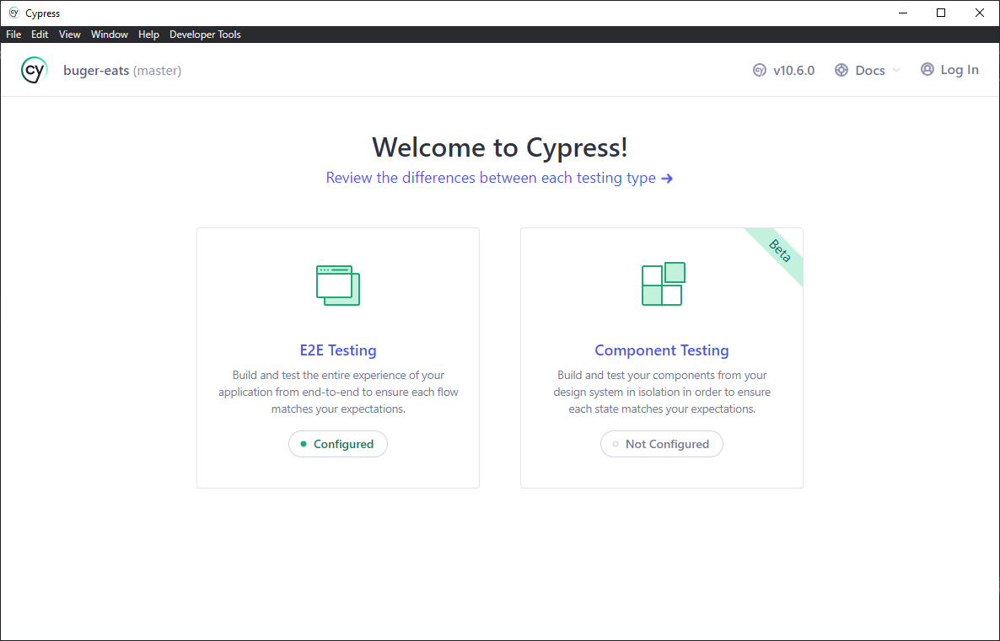
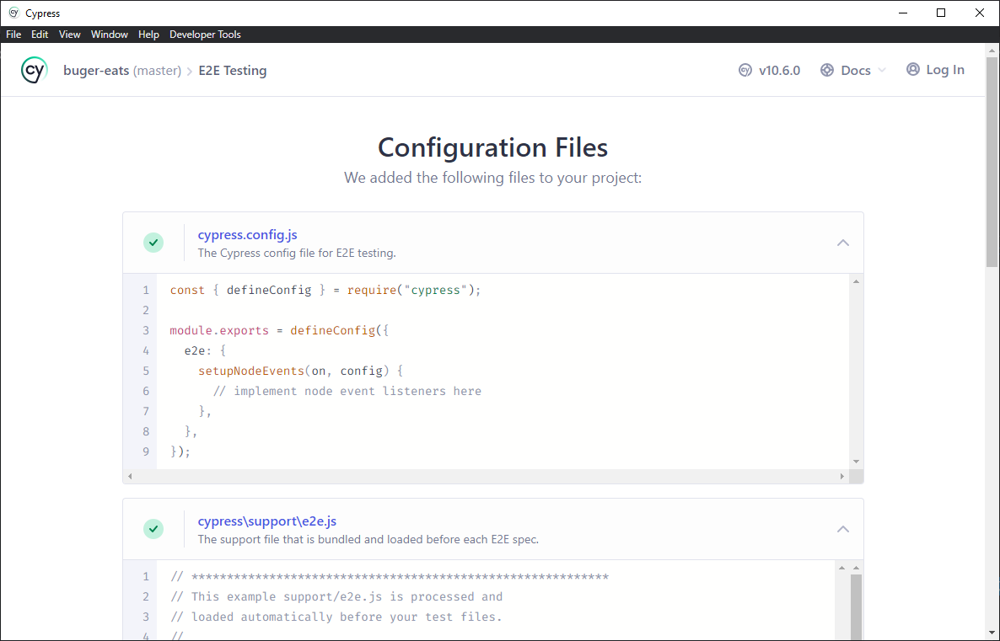
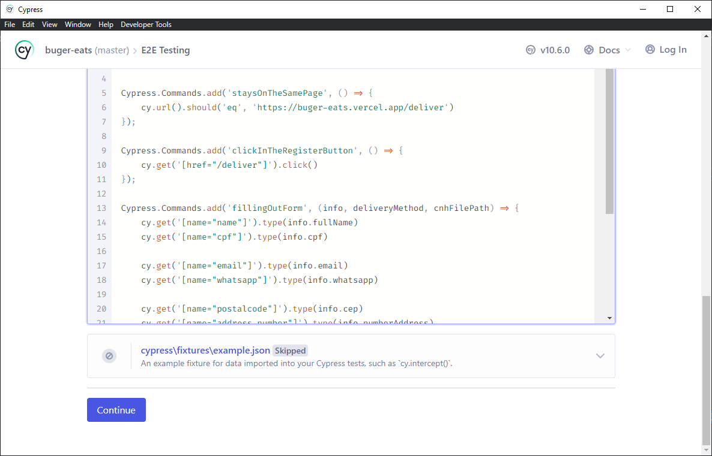
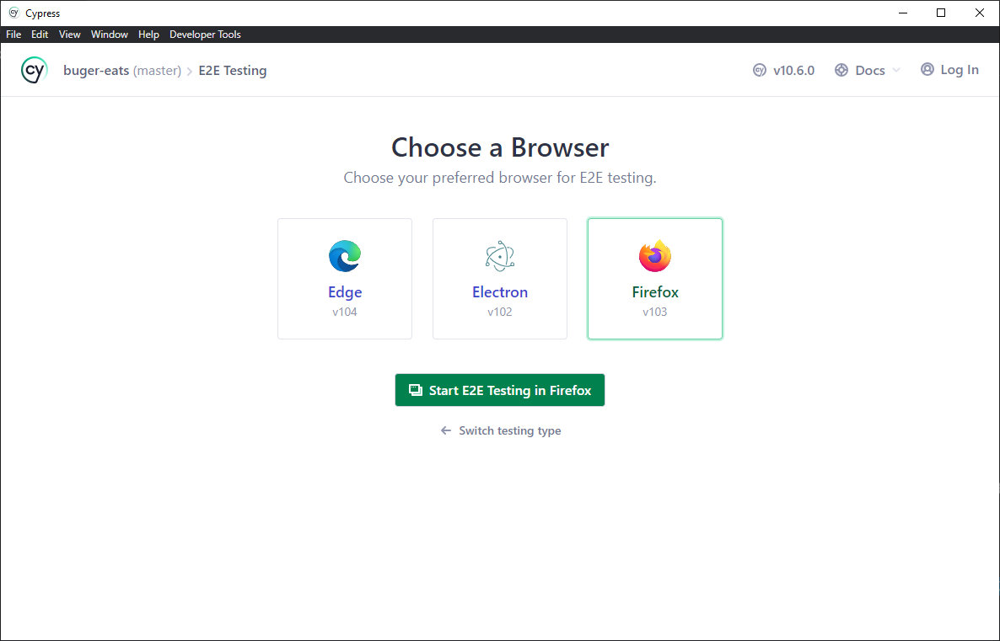
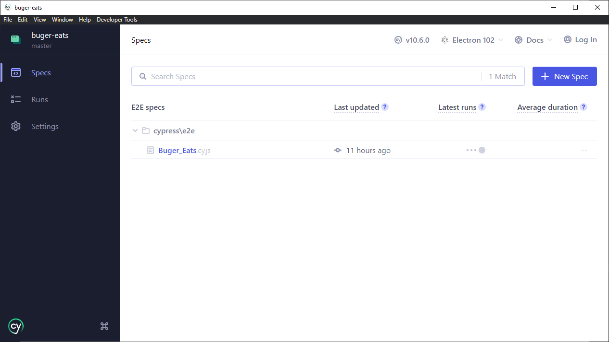
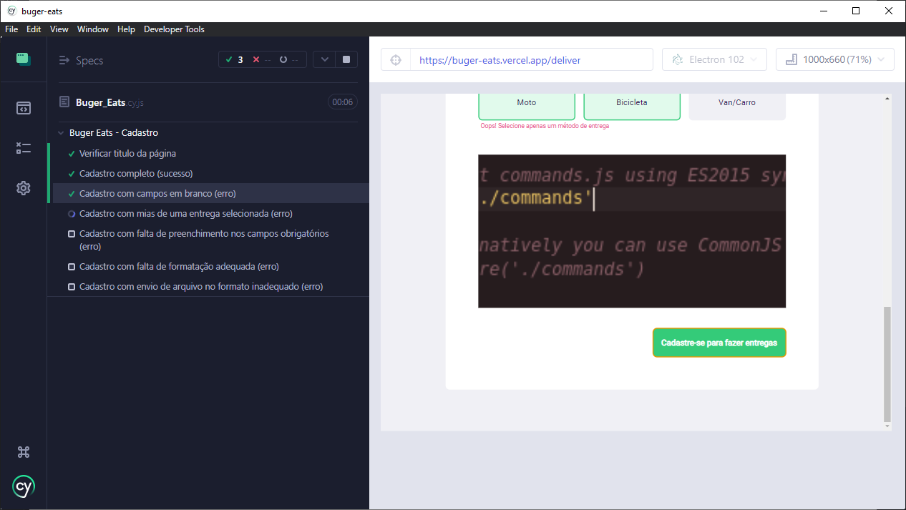

# buger-eats

Olá, espero que gostem do resultado do teste, para qualquer coisa, estou a disposição para atender. 
Os casos de teste estão no arquivo <a href="https://github.com/Dan-Sillva/buger-eats/blob/master/Casos-de-Teste_BugerEats.pdf">Casos-de-Teste_BugerEats.pdf</a>

### Pré requisitos :
- Editor de código instalado (como vscode)
- Node e Npm
- Git

Obs: estou utilizando linux, mas fiz os testes no windows e adaptei o tutorial para atender os dois.

---
### Passo a passo: 
 
  > Para facilitar a execução no windows, estaremos realizando o processo de intalação do cypress no escopo do projeto, e criação do projeto node.

 

#### 1. Clonando repositório do git
  
Para clonar o repositório, basta rodar o seguinte comando em seu terminal: (git ou powerShell no windows) 

      git clone https://github.com/Dan-Sillva/buger-eats.git
      
> Obs: Provavelmente você vai precisar logar com seu github.

 

#### 2. Inicial projeto node

Para inicial o projeto node, abra seu terminal na pasta do projeto (que acabou de clonar), e execute o seguinte comando: 

      npm init -y

 

#### 3. Instalar o cypress e dependências

Para instalar os pré requisitos, deve-se executar o seguinte comando no terminal, ainda na pasta do projeto: 
(estaremos instalando o cypress apenas para aquele projeto, juntamente com a bibliotéca de upload de arquivo) 

      npm install cypress cypress-file-upload --save-dev 

 

#### 4. rodar

Para rodar o projeto, basta executar o seguinde comando no terminal: 

    npx cypress open

 

---
### No Cypress:

Após rodar o ultimo comando, uma nova janela deve se abrir, iniciando o cypress. 

# 

Aqui, você deve clicar no quadro "E2E Testing". Com isso, indicamos que queremos rodar os testes E2E. 

Na próxima página, podemos apenas rolar para baixo e clicar no botão "Continue". 

# 

Na próxima página, teremos as opções de navegadores para rodar o cypress. 

# 

Pode selecionar o que achar melhor e clicar em "Start E2E Testing". Por padrão, ele vem com o navegador Electron, mas se outros navegadores, como Firefox
ou Chrome, estiverem instalados em sua máquina, também devem aparecer aqui (caso o cypress tenha suporte para o navegador em questão)  

# 

Por fim, o navegador selecionado ira abrir e exibir todo o conjunto de arquivos de teste do seu projeto (Nesse caso, só teremos um). 

# 

Agora basta clicar no teste que deseja executar, neste caso, "Buger_Eats.cy.js", que o cypress ira executar os testes automatizados.

# 
